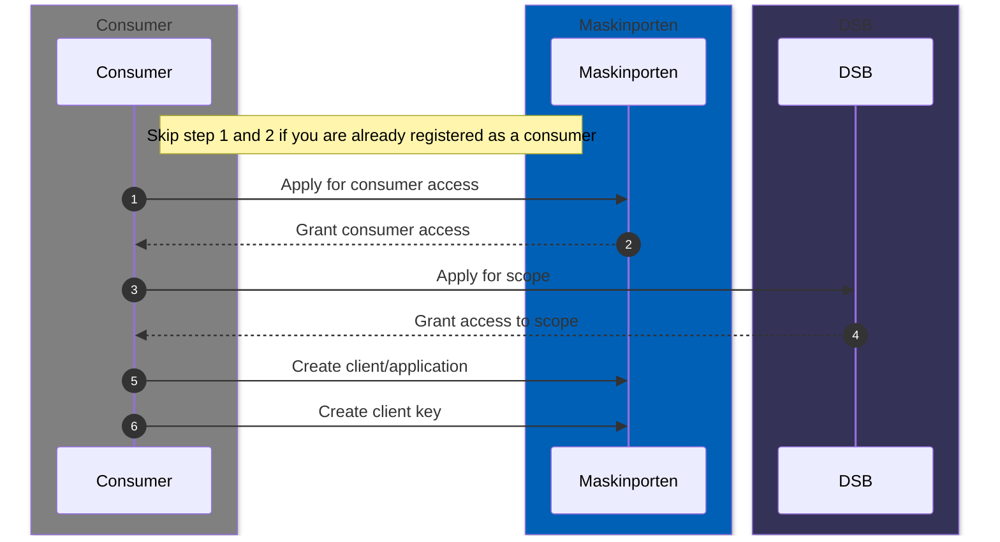
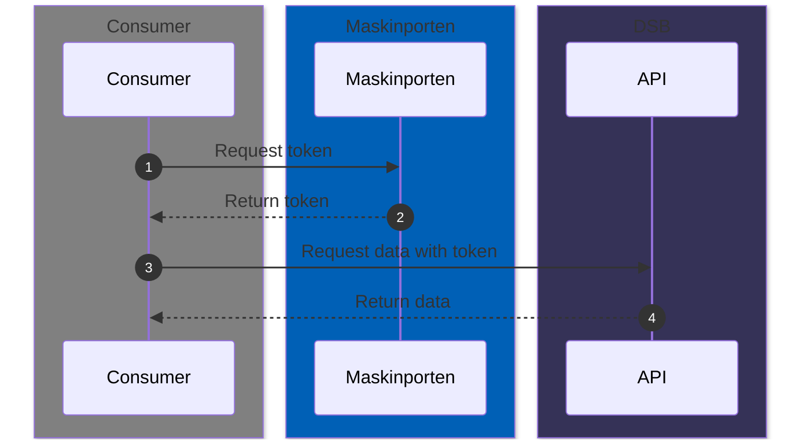

# DSB Data API

A [RESTful](https://snl.no/REST_-_API) API secured by [Maskinporten](https://samarbeid.digdir.no/maskinporten/dette-er-maskinporten/96) for sharing datasets from DSBs dataplatform.

## About the API

The API provides access to select datasets from DSBs dataplatform.

### Features:
  - Pagination
  - Column selection
  - Filtering
  - Sorting
  - Multiple output formats (Parquet, JSON, XML, CSV)
    <br>We default to [parquet](https://parquet.apache.org/docs/overview/) and **strongly** recommend using it for performance reasons.

### Documentation:
| Environment | OpenAPI Specification            | Redoc                             |
|-------------|----------------------------------|-----------------------------------|
| Development | https://dev.data-api.dsb.no/docs | https://dev.data-api.dsb.no/redoc |
| Production  | https://data-api.dsb.no/docs     | https://data-api.dsb.no/redoc     |

## Getting Started
Before you can integrate with the API or run any of the examples you have be registered with Maskinporten as a consumer and receive scope permission from DSB.
<br>You can find more information about how to register [here](https://samarbeid.digdir.no/maskinporten/konsument/119).

### Setup examples
1. Setup a python virtual environment and install dependencies
``` bash
# Change directory to examples folder
cd examples

# Create and activate virtual python environment
python -m venv .venv
source .venv/bin/activate  # On Windows use `.venv\Scripts\activate
pip install -r requirements.txt
mv .env.example .env # On windows move .env.example .env
```

2. Fill in the required environment variables in the `.env`

### Acquiring Access
The following sequence diagram illustrates the steps required to access datasets from the api.


### Integration flow
Once you have acquired access, you can start integrating with the API.
<br>Every call you make to the API will follow this pattern.
