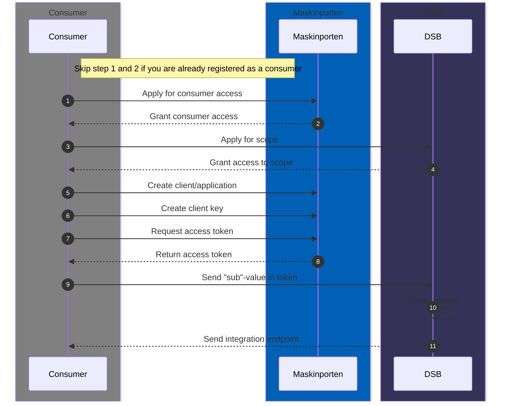
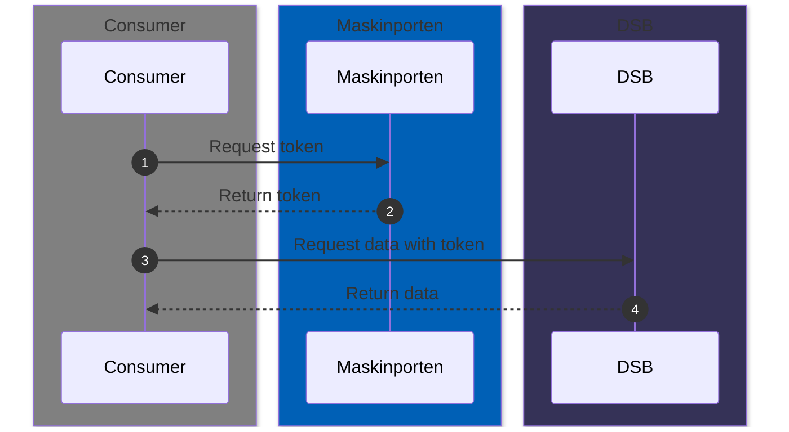

# DSB Dataplatform
DSBs dataplatform is running on [Databricks](https://www.databricks.com/)
<br>Integration is done using [Delta Sharing](https://www.databricks.com/product/delta-sharing) with authentication provided by [Skyporten](https://docs.digdir.no/docs/Maskinporten/maskinporten_skyporten.html) / [Maskinporten](https://samarbeid.digdir.no/maskinporten/dette-er-maskinporten/96) using [OAuth 2.0](https://oauth.net/2/).

## Getting Started
Before you can integrate with DSBs dataplatform or run any of the examples you have be registered with Maskinporten as a consumer.
<br>You can find more information about how to register [here](https://samarbeid.digdir.no/maskinporten/konsument/119).

### Aquiring Access
The following sequence diagram illustrates the steps required to get access to DSBs dataplatform.
<br><a href="#generate-private-key">Tip for step 6</a>


### Integration flow
Once you have acquired access, you can start integrating with DSBs dataplatform.
<br>To integrate you can use any technology that supports Delta sharing and OAuth 2.0.
<br>We recommend and provide examples using [Python](https://www.python.org) as it has support for both protocols and has good libraries for processing data.


### Tips
#### Generate private key
  You can easily create a private key using [openssl](https://www.openssl.org/):
  ```bash
  openssl genpkey -algorithm RSA -out private_key.pem -pkeyopt rsa_keygen_bits:2048
  ```
  After the `private_key.pem` file is created you can paste its contents into the private key input field when creating a client key in Maskinporten.

## Code examples
All code examples are found in the [examples](./examples) folder and are written as [Python Jupyter Notebooks](https://docs.jupyter.org/en/latest/)

### Prerequisite software
- Git (To clone this repository)
- Visual Studio Code (VSCode) or any other code editor that supports Jupyter Notebooks)
- Python 3.12

If VSCode is used: you should also install the recommended extensions when prompted for it when opening this repository.

### Setup
1. Clone this repository:
   ```bash
   git clone https://github.com/dsb-norge/dsb-integration-guides.git
   ```
1. Open the cloned repository in Visual Studio Code (VSCode):
   ```bash
   code [YOUR_PATH]/dsb-integration-guides/
   ```
1. Open a terminal in VSCode
   <br> (Mac) ⌃ + ⇧ + \`
   <br> (Windows/Linux) Ctrl + \`

1. Change directory to the `dataplatform/examples` folder:
   ```bash
   cd dataplatform/examples
   ```
2. Install the required Python packages:
   ```bash
   pip install -r requirements.txt
   ```
3. Copy your `private_key.pem` file to the `examples` folder.
   ```bash
   cp [YOUR_PATH]/private_key.pem .
   ```